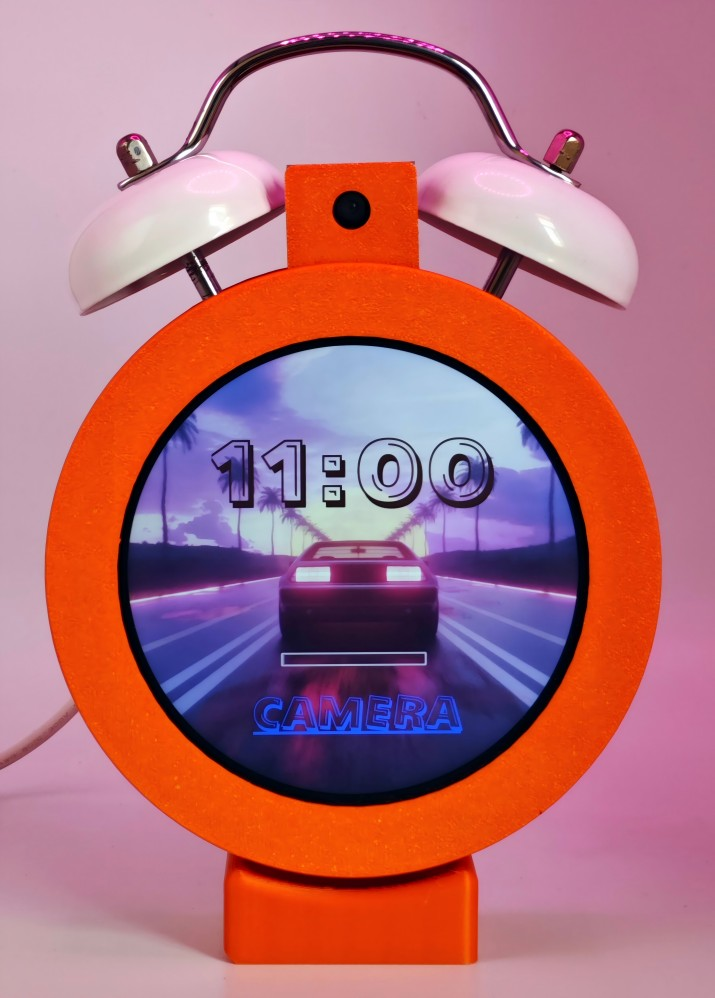

# RP5-CLOCK

与非网2024汽车应用创意挑战赛作品——行车安全闹钟

通过摄像头检测人眼的闭合程度和嘴部的张开程度来推算疲劳值，超过阈值则进行打铃报警

## 硬件

- 树莓派5（比赛官方提供报销）

- 微雪3.4寸 800x800 DSI 屏幕

- 微雪 IMX219 120视场角 DSI 摄像头

- 直流电机及驱动板

- 3d打印外壳 嘉立创面板 螺丝若干

## 软件

  - Pyside6
  - mediapipe